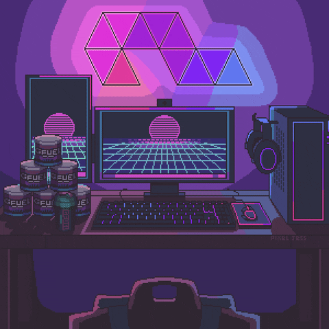

# 👋 Hi, I'm David Larson!

### 💻 Full Stack Developer

  

  

---

## 🚀 Skills

### Front-end

  

### Back-end & Database

  

---

## 📊 GitHub Stats

  
  

  

---

## 🛠️ Technologies

---

## 🌐 Socials

  

  

  

---

## 🐍 Contribution Activity

  

---

  

